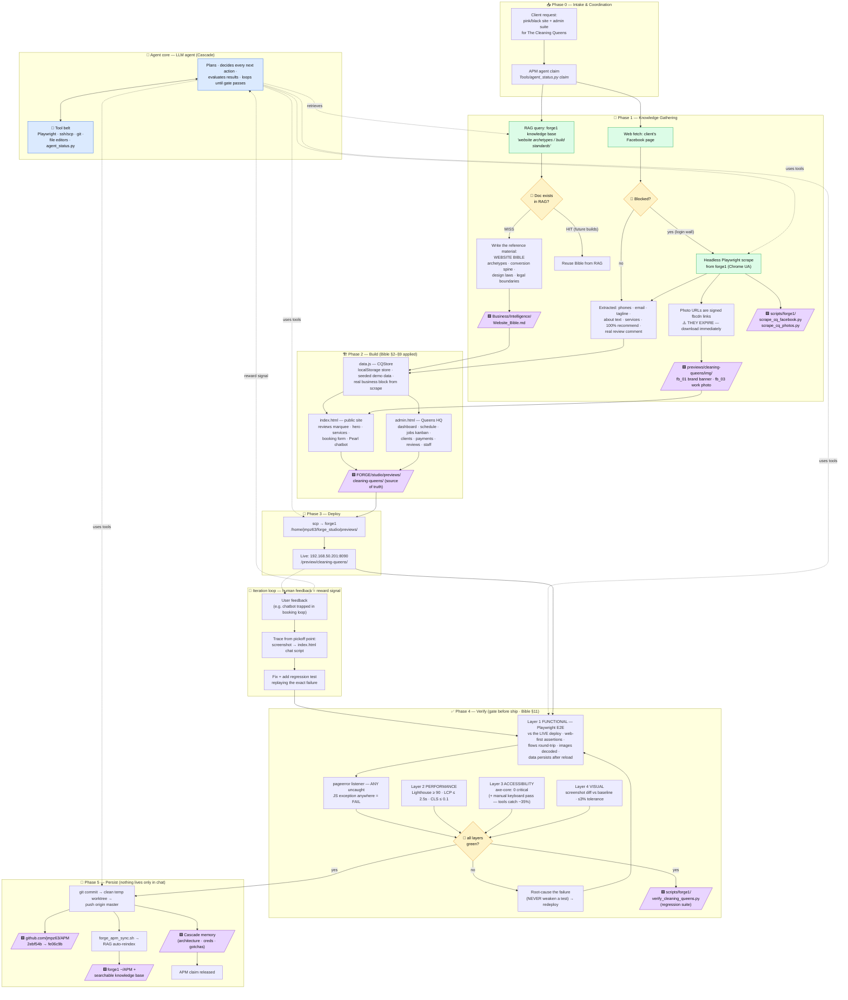

# Website Build Process — Cleaning Queens KC (traceable pipeline)

How the site was actually built on 2026-07-22: every knowledge source,
query, decision point, and the artifacts you can pick up ("pickoff points")
to trace or resume any stage. Companion to `Website_Bible.md`.

Legend: 🟪 pickoff point (artifact on disk/git you can resume from) ·
🔶 decision gate · 🟩 external knowledge in · 🔵 agent core (the
LLM agent + tool belt driving every arrow; human feedback is its
reward signal).

Agent-pipeline anatomy mapped: **LLM agent** = agent core · **tools** =
tool belt · **retrieval** = RAG query nodes · **verification gates** =
amber diamonds · **human feedback** = iteration loop.

## Pickoff points (resume/trace from any of these)

| # | Artifact | What you can do from it |
|---|----------|------------------------|
| 1 | `Business/Intelligence/Website_Bible.md` | Start ANY new client site — archetype, spine, legal rules |
| 2 | `FORGE/scripts/forge1/scrape_cq_facebook.py` / `scrape_cq_photos.py` | Re-scrape client socials for fresh info/photos |
| 3 | `FORGE/studio/previews/cleaning-queens/img/` | Client's real brand assets (fbcdn originals expired) |
| 4 | `FORGE/studio/previews/cleaning-queens/` | Source of truth — edit, then scp to forge1 |
| 5 | `FORGE/scripts/forge1/verify_cleaning_queens.py` | Regression-test any change (29 checks) |
| 6 | `github.com/jmpz63/APM` commits `2ebf54b…fe06c9b` | Full history; diff any iteration |
| 7 | forge1 `~/APM` + RAG index | Agents can query the Bible + this doc |
| 8 | Cascade memory | Session-independent context (creds, gotchas, deploy path) |

## Verification process — the 8 steps (Bible §11)

1. **Define the pass condition before building** — every change gets a
   testable claim first ("chat answers pricing with $249"). Can't phrase
   a check → requirement isn't clear yet.
2. **Test the deployed thing, not the local copy** — headless Playwright
   against the live URL catches deploy failures too.
3. **Regression tests from real failures** — every human-found bug ships
   with a test replaying the exact failure (the chatbot booking-trap test
   replays the user's screenshot scenario step by step).
4. **Catch the unknowns with error listeners** — `pageerror` collection
   fails the run on ANY uncaught JS exception, even in untested paths.
5. **Gate before persist** — deploy → verify → only then commit/push/RAG.
   Broken states never reach GitHub or the knowledge base.
6. **Verify the verifier's environment** — cheap sanity checks (file
   exists on server, HTTP 200, diagram parses) prevent debugging ghosts.
7. **Root-cause failures, never patch tests** — when the pet intent lost
   a scoring tie, the fix was general plural-tolerant matching, not a
   loosened assertion; then the FULL suite re-ran.
8. **Human review is the final gate** — tests prove it works; the human
   says whether it's right. Their feedback becomes step 3's next
   regression test, closing the loop.
