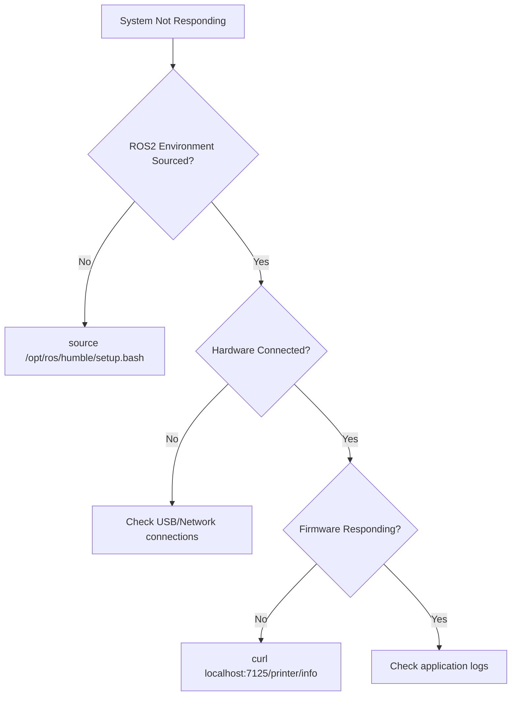

# AI Agent Onboarding & Knowledge Transfer Patterns
*Extracted from moveo_bridge_ws Successful Onboarding System*

## 🎯 **Rapid AI Agent Integration Framework**

### **30-Minute Productivity Target Model**
The moveo_bridge_ws project achieved **reproducible 30-minute onboarding** from clean Ubuntu to functional robotic control. This framework can be applied to any complex technical system.

#### **Onboarding Success Architecture**
```
00_Mission.txt           → Clear objectives & success criteria
01_Project_Manual.md     → Living status & capability snapshot  
02_Progress_Log.md       → Historical decision trail
03_Lessons_Learned.json  → Structured failure/resolution database
04_Hardware_Architecture/ → Technical specifications centralized
05_Tips_Tricks.md       → Quick-reference operational knowledge
```

### **Critical Design Patterns for AI Agent Success**

#### **1. Mission-First Documentation**
```yaml
mission_structure:
  primary_objective: "Single clear, measurable goal"
  current_status: "Timestamp + current capability state"  
  success_criteria: "Explicit validation checkpoints"
  next_expansions: "Roadmap after baseline achievement"
  
principles:
  - "Prefer stable, explicit configuration over magic auto-detection"
  - "Always verify consistency across system components"  
  - "Log before act: every hardware command must have preceding log"
  - "Treat physical enablement as explicit stage (never implicit)"
```

#### **2. Structured Lessons Learned Database**
```json
{
  "topic": "Specific technical area",
  "issue": "Exact symptom observed", 
  "cause": "Root cause analysis result",
  "resolution": "Step-by-step fix procedure",
  "category": "Classification for pattern recognition",
  "severity": "Impact assessment (low/medium/high)"
}
```

**Key Innovation:** Machine-readable JSON format enables AI agents to quickly pattern-match similar issues without re-debugging.

## 📚 **Knowledge Base Architecture Principles**

### **Information Hierarchy for AI Consumption**

#### **Level 1: Mission Context (Always First)**
- **Purpose:** What is this system trying to achieve?
- **Status:** What works now vs what's pending?
- **Success Criteria:** How do you know when it's working?
- **Constraints:** What are the hard limitations?

#### **Level 2: Operational Procedures**
- **Environment Setup:** Exact commands to establish working state
- **Validation Checkpoints:** How to verify each step succeeded
- **Common Workflows:** Proven procedures for typical tasks
- **Emergency Procedures:** Recovery from failure states

#### **Level 3: Technical Architecture**
- **Data Flow Diagrams:** How information/commands move through system
- **Interface Specifications:** APIs, protocols, message formats
- **Configuration Templates:** Working config files with annotations
- **Dependency Maps:** What needs what to function

#### **Level 4: Troubleshooting Intelligence**
- **Failure Mode Database:** Symptoms → Root Causes → Solutions
- **Decision Trees:** Systematic diagnostic procedures  
- **Performance Baselines:** Expected behavior metrics
- **Tool References:** What tools solve which problems

### **Documentation Maintainability Patterns**

#### **Living Documents Strategy**
```markdown
# Status Headers (Update with every major change)
> Status: CURRENT_CAPABILITY_STATE
> Last Updated: YYYY-MM-DD  
> Next Milestone: SPECIFIC_TARGET
> Confidence: HIGH/MEDIUM/LOW based on testing
```

#### **Single Source of Truth Protocol**
- **Central Repository:** One authoritative location per topic
- **Reference Pattern:** Other documents link to central source, never duplicate
- **Update Discipline:** Change source first, then notify dependent documents
- **Version Control:** Git commits with descriptive messages for knowledge changes

## 🤖 **AI Agent Interaction Optimization**

### **Context Provision Strategies**

#### **Frontload Critical Information**
```markdown
# IMMEDIATE CONTEXT (First 50 lines)
- What this system does
- What's working vs broken  
- How to get to working state quickly
- Where to find detailed information
```

#### **Progressive Detail Disclosure**
- **Quick Start:** Get to functional state in minimum steps
- **Reference Material:** Deep technical details available on-demand  
- **Troubleshooting:** Structured diagnostic procedures
- **Enhancement Paths:** How to extend capabilities

### **Machine-Readable Knowledge Formats**

#### **Structured Data Integration**
```yaml
# Embed YAML metadata for AI parsing
system_status:
  last_verified: "2025-10-02"
  confidence_level: "high"
  working_components: ["planning", "single_joint_control", "hardware_bridge"]
  pending_components: ["multi_joint", "feedback_loop", "safety_layers"]
  
quick_start:
  time_estimate: "30 minutes"
  prerequisites: ["Ubuntu 22.04", "ROS2 Humble", "Python 3.10+"]
  validation_command: "ros2 topic list | grep joint_trajectory"
  success_indicator: "Physical joint motion observed"
```

#### **Decision Tree Formats**


## 🔄 **Continuous Knowledge Improvement**

### **Feedback Loop Integration**
```python
# Knowledge Base Update Protocol
def update_knowledge_base(interaction_result):
    """
    Systematic knowledge capture from AI agent interactions
    """
    if interaction_result.time_to_solution > expected_baseline:
        log_knowledge_gap(interaction_result.topic, interaction_result.confusion_points)
    
    if interaction_result.novel_solution_found:
        add_lessons_learned_entry(interaction_result.issue, interaction_result.solution)
    
    update_success_metrics(interaction_result.onboarding_time)
```

### **Performance Metrics for Knowledge Base Quality**

#### **AI Agent Onboarding Metrics**
```yaml
quality_indicators:
  time_to_first_success: "< 30 minutes"
  documentation_completeness: "> 90% questions answered"
  error_recovery_speed: "< 5 minutes per issue"
  knowledge_reuse_rate: "> 80% solutions from existing docs"
  
improvement_triggers:
  - "Same question asked > 3 times → Add FAQ entry"
  - "Setup failure rate > 10% → Improve quick-start guide"  
  - "Novel issue discovered → Update troubleshooting database"
```

## 🎓 **Meta-Patterns for Knowledge Architecture**

### **Successful AI Agent Knowledge Base Characteristics**

#### **1. Explicit State Management**
- Current system state always visible
- Clear transitions between states documented
- Validation checkpoints for each state change
- Recovery procedures for failure states

#### **2. Assumption Documentation**
- Dependencies explicitly stated
- Environmental requirements specified  
- Version compatibility matrices provided
- Configuration assumptions documented

#### **3. Progressive Complexity Management**
- Simple working baseline first
- Incremental enhancement paths documented
- Complexity introduction order specified
- Rollback procedures for each addition

#### **4. Multi-Modal Knowledge Representation**
- Text: Explanatory content for understanding
- Code: Executable examples and templates  
- Data: Structured specifications and configurations
- Diagrams: Visual system architecture and flows

### **Anti-Patterns That Block AI Agent Success**

#### **Documentation Anti-Patterns**
- ❌ **Scattered Information:** Related knowledge in multiple disconnected files
- ❌ **Stale Status:** Outdated capability descriptions causing confusion
- ❌ **Assumption Hiding:** Implicit dependencies not documented
- ❌ **Magic Numbers:** Configuration values without explanation
- ❌ **Procedure Fragmentation:** Multi-step processes split across documents

#### **Knowledge Organization Anti-Patterns**  
- ❌ **Deep Hierarchy:** Important information buried >3 levels deep
- ❌ **Duplicate Sources:** Multiple "authoritative" versions creating conflicts
- ❌ **Binary State Documentation:** Only success paths documented, not failure recovery
- ❌ **Tool-Specific Coupling:** Knowledge tied to specific tools rather than concepts

## 🚀 **Implementation Recommendations for APM Knowledge Base**

### **Immediate Improvements**
```bash
# 1. Standardize Knowledge Entry Points
APM/Knowledge_Base/
├── 00_QUICK_START.md          # 30-minute productivity guide
├── 01_SYSTEM_STATUS.md        # Current capability snapshot  
├── 02_TROUBLESHOOTING.json    # Structured issue database
├── 03_ARCHITECTURE.md         # Technical system overview
└── 04_ENHANCEMENT_ROADMAP.md  # Future development paths

# 2. Implement Living Status Headers
# Add to all major documents:
> Status: [WORKING|PARTIAL|BROKEN|UNTESTED]
> Last Verified: YYYY-MM-DD
> Prerequisites: [clear dependency list]
> Success Criteria: [how to validate this works]
```

### **Knowledge Transfer Integration Pattern**
```python
# Standard procedure for extracting knowledge from projects like moveo_bridge_ws
def integrate_project_knowledge(source_project_path):
    """
    Systematic knowledge extraction and integration protocol
    """
    # 1. Extract mission/objectives
    mission_docs = find_files(source_project_path, patterns=["*mission*", "*readme*", "*overview*"])
    
    # 2. Mine lessons learned  
    lessons = find_files(source_project_path, patterns=["*lesson*", "*tip*", "*trick*"])
    
    # 3. Capture working configurations
    configs = find_files(source_project_path, patterns=["*.yaml", "*.json", "*.cfg"])
    
    # 4. Document proven procedures
    scripts = find_files(source_project_path, patterns=["*.sh", "*.py", "*launch*"])
    
    # 5. Integrate into APM knowledge hierarchy
    categorize_and_integrate(mission_docs, lessons, configs, scripts)
```

---

## 💡 **Key Success Insight: Architecture vs Implementation**

**Critical Learning:** The moveo_bridge_ws project succeeded because it prioritized **knowledge architecture** over implementation complexity. 

**Winning Pattern:**
1. **Mission Clarity** → Everyone understands the goal
2. **Current State Transparency** → No confusion about what works  
3. **Structured Learning Capture** → Failures become assets
4. **Reproducible Procedures** → Success is repeatable
5. **Progressive Complexity** → Simple baselines before advanced features

**Application to APM:** Apply this same knowledge architecture discipline to all APM projects for consistent AI agent productivity.

---

*Source: moveo_bridge_ws Onboarding System Analysis*  
*Validation: 30-minute AI agent productivity target achieved*  
*Pattern Status: Ready for APM-wide implementation*